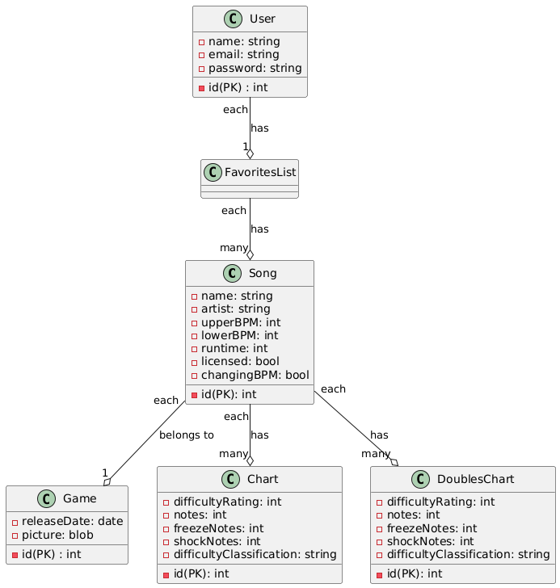

# Overview

This web application lets users explore and interact with DDR songs, view their charts, and create personalized playlists. Users can search for songs by name, artist, or BPM range, and explore different chart difficulties for each song. Each user can sign up, log in, and manage a personal favorites list, which can contain multiple songs. The system also allows admins to manage content, ensuring the database stays up to date. Songs are connected to charts with details like difficulty rating and note types, and each user’s favorites list is tied to their account. The app aims to provide an engaging experience for DDR enthusiasts, combining easy navigation with customizable features. 

## need to include use case diagram , class diagram, sequence diagram, and activity diagram.

# Design

## User Stories

User Story #1: User Account Creation

As a new user, I want to create an account using my email and password, So that I can access personalized features on the website.

Acceptance Criteria:

- User can create an account by entering a valid email and password.
- The system verifies the email format and checks for existing accounts.
- A confirmation email is sent to the user after successful account creation.
- If the user enters invalid data, an appropriate error message is displayed.

Point Estimate: 1

User Story #2: Account Update (Email & Password)

As a registered user, I want to update my account details, such as email and password, So that I can maintain up to date information and secure my account.

Acceptance Criteria:

- User can change their email address and password from their profile settings.
- New email and password are validated for proper formatting and strength.
- User receives a confirmation email for email address changes.
- The system logs the user out after a password change, prompting them to log in again with the new password.

Point Estimate: 2

User Story #3: Create Playlists

As a logged-in user, I want to create playlists by selecting songs from the database, So that I can organize and listen to my favorite songs.

Acceptance Criteria:
- User can create a playlist by selecting one or more songs.
- User can name the playlist and save it to their account.
- The playlist can be viewed, edited, and deleted by the user.
- Playlists are displayed on the user's profile page.

Point Estimate: 3

User Story #4: Search Songs

As a user, I want to search for songs in the database, So that I can find and listen to my preferred songs quickly.

Acceptance Criteria:
- User can search by song name, artist, or genre.
- Search results are displayed in a list format, showing the song title, artist, and BPM.
- Users can click on a song to view more details, such as the song’s chart information.

Point Estimate: 3

User Story #5: Admin - Delete Songs & Charts

As an admin, I want to delete songs and charts from the system, So that I can remove outdated or inappropriate content.

Acceptance Criteria:
- Admin has the ability to delete songs and their associated charts.
- A confirmation prompt is displayed before deletion to prevent accidental removals.
- Deleted songs and charts are removed from all user playlists and searches.

Point Estimate: 1

User Story #6: Admin - Edit Songs & Charts

As an admin, I want to edit songs and charts in the system, So that I can update incorrect information or improve the song’s details.

Acceptance Criteria:
- Admin can edit the song’s name, artist, BPM range, and chart information.
- Changes are saved immediately and reflected on the website.
- Admins can review changes before they are finalized.

Point Estimate: 1

## Sequence Diagram

@startuml

actor User
participant "Web Application" as WebApp
database "Song Database" as DB

User -> WebApp: Enter search query
WebApp -> DB: Send search query
DB -> DB: Search for matching songs
DB --> WebApp: Return search results
WebApp --> User: Display search results
User -> WebApp: Click on a song
WebApp -> WebApp: Display song details

@enduml

# need to upload a photo of BOTH sequence diagram

@startuml

actor User
participant "Web Application" as WebApp
database "Playlist Database" as PlaylistDB

User -> WebApp: Click "Create Playlist"
WebApp -> User: Prompt for playlist name
User -> WebApp: Enter playlist name and click "Create"
WebApp -> PlaylistDB: Send playlist name
PlaylistDB -> PlaylistDB: Store playlist data
PlaylistDB --> WebApp: Return success confirmation
WebApp --> User: Display success message
User -> WebApp: Redirect to playlist page

@enduml


## Model 

Include a class diagram that clearly describes the model classes used in the project and their associations.



# Development Process 

This section should describe, in general terms, how Scrum was used in this project. Include a table summarizing the division of the project into sprints, the user story goals planned for each sprint, the user stories actually completed, and the start and end dates of each sprint. You may also add any relevant observations about the sprints as you see fit.

## US# 1: Users should be able to create accounts (1 point)
## US# 2: Users should be able to update their account details, including email and password (2 points)
## US# 3: Users should be able to create playlists (3 points)
## US# 4: Users should be able to search the database of songs (3 points)
## US# 5: Admins should be able to delete songs and charts (1 point)
## US# 6: Admins should be able to edit songs and charts (1 point)
## US# 7: Users should be able to view and manage their playlists (2 points)
## US# 8: Users should be able to search songs by different filters (2 points)
## US# 9: Users should be able to add songs to their playlist (3 points)

| Sprint# | Goals                                  | Start      | End        | Done       | Observations |
|---------|----------------------------------------|------------|------------|------------|--------------|
| 1       | US# 1, US# 2, US# 3                    | 11/12/24   | 11/18/24   | US#1, US#2  | User registration and account update functionality completed. Playlist creation partially implemented. |
| 2       | US# 4, US# 5, US# 6                    | 11/19/24   | 11/25/24   | US#4, US#5  | Song search and admin song deletion/editing implemented. Basic admin features were tested. |
| 3 & 4   | US# 7, US# 8, US# 9, Finalization, Bug Fixes, Documentation | 11/26/24   | 12/05/24   | US#7, US#8, US#9 | Playlist management, song search filters, song addition to playlists, final bug fixes, and documentation completed. |


Sprint Observations:
Sprint 1: The first sprint was focused on setting up the foundational elements of the project, such as user account creation and updating. While user registration was completed, the playlist creation feature required more attention in the following sprint.
Sprint 2: In this sprint, the focus shifted to implementing song search functionality and admin features, such as the ability to delete and edit songs. Some minor issues arose with user authentication, but they were resolved in the next sprint.
Sprint 3: This sprint focused on the user experience, including managing and interacting with playlists. The playlist management was successfully implemented, as well as the ability to search for songs using different filters.
Sprint 4: The final sprint is dedicated to finalizing the features, conducting user acceptance testing, fixing bugs, and ensuring that all documentation is completed. The goal is to polish the application, fix edge cases, and make it ready for deployment.

# Testing 


| Test Case No. | Description                          | Test Data                                   | Expected Result                                    | Actual Result | Status         |
|---------------|--------------------------------------|---------------------------------------------|----------------------------------------------------|----------------|----------------|
| #1            | Sign up with valid email and password | Email: testuser10, Password: test123        | User account created successfully without duplicate email | Pass         |
| #2            | Login with valid credentials         | Email: testuser10, Password: test123        | User logged in successfully                        | Pass          |
| #3            | Search Chart by song name            | Song name: NAOKI                            | Chart with Happy song displayed                    | INC           |
| #4            | Add Chart to Playlist                | Playlist name: MyPlaylist, Chart name: Happy | Chart added to Playlist successfully               | INC           |
| #5            | Add Song to Playlist                 | Playlist name: MyPlaylist, Song name: Happy  | Song added to Playlist successfully                | INC           |
| #6            | Edit Chart details                   | Chart name: Happy, New name: NewHappy       | Chart details updated successfully                 | INC           |
| #7            | Edit Song details                    | Song name: Happy, New name: NewHappy        | Song details updated successfully                  | INC           |
| #8            | Update Name and Password             | Email: testuser1, New name: NewUser, New password: test456 | User details updated successfully         | INC           |
| #9            | Update Password only                 | Email: testuser1, New password: test456     | Password updated successfully                      | INC           |
| #10           | Create Playlist with duplicate name  | Playlist name: MyPlaylist                   | Error message displayed                            | INC           |
| #11           | Update email with invalid email      | Email: testuser1, New email: invalidemail   | Error message displayed                            | INC           |
| #12           | Delete Chart                         | Chart name: Happy                           | Chart deleted successfully                         | INC           |
| #13           | Delete Song                          | Song name: Happy                            | Song deleted successfully                          | INC           |
| #14           | Delete Playlist                      | Playlist name: MyPlaylist                   | Playlist deleted successfully                      | INC           |
| #15           | Search Song by invalid filter        | Filter: invalid                             | Error message displayed                            | INC           |

Explanation of Status:
- **Pass**: Test case passed successfully.
- **INC**: Test case is incomplete or not executed.
 
 White-Box Testing:

 

 Black-Box Testing:


In this section, share the results of the tests performed to verify the quality of the developed product, including the test coverage in relation to the written code. There is no minimum code coverage requirement, but ensure there is at least some coverage through one white-box test and one black-box test.

# Deployment 

The final product must demonstrate the integrity of at least 5 out of the 6 planned user stories. It should be packaged as a Docker image and be deployable using:

```
docker compose up
```